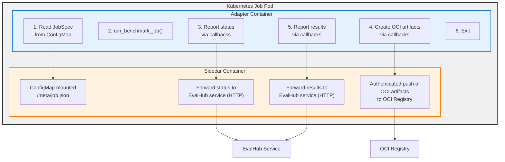

# EvalHub SDK

[](https://pypi.org/project/eval-hub-sdk/)
[](https://github.com/eval-hub/eval-hub-sdk/actions/workflows/test.yml)

**Framework Adapter SDK for EvalHub Integration**

The EvalHub SDK provides a standardized way to create framework adapters that can be consumed by EvalHub, enabling a "Bring Your Own Framework" (BYOF) approach for evaluation frameworks.

## Overview

The SDK creates a common API layer that allows EvalHub to communicate with ANY evaluation framework. Users only need to write minimal "glue" code to connect their framework to the standardized interface.

```
EvalHub → (Standard API) → Your Framework Adapter → Your Evaluation Framework
```

## Architecture

The adapter SDK uses a **job runner architecture**:



### Package Organization

The SDK is organized into distinct, focused packages:

**Core (`evalhub.models`)** - Shared data models
- Request/response models for API communication
- Common data structures for evaluations and benchmarks

**Adapter SDK (`evalhub.adapter`)** - Framework adapter components
- `FrameworkAdapter` base class with `run_benchmark_job()` method
- Job specification models (`JobSpec`, `JobResults`)
- Callback interface for status updates and OCI artifacts
- Example implementations

**Client SDK (`evalhub.client`)** - REST API client for EvalHub service
- HTTP client for submitting evaluations to EvalHub
- Resource navigation (providers, benchmarks, collections)
- See [Getting Started with the CLI](https://eval-hub.github.io/getting-started/cli/)

### Key Components

1. **JobSpec** - Job configuration loaded from ConfigMap at pod startup
2. **FrameworkAdapter** - Base class that implements `run_benchmark_job()` method
3. **JobCallbacks** - Interface for reporting status and persisting artifacts
4. **JobResults** - Evaluation results returned when job completes
5. **EvalCardMetadata** - Standardized evaluation disclosure (Dhar et al., arXiv:2511.21695): modalities, languages, capability and safety evaluations
6. **EnvironmentCardMetadata** - Operational context of an evaluation run: hardware, software, Kubernetes, model identity, and run provenance
7. **Sidecar** - Container that handles service communication (provided by platform)

## Quick Start

### 1. Installation

```bash
# Install from PyPI (when available)
pip install eval-hub-sdk

# Install from source
git clone https://github.com/eval-hub/eval-hub-sdk.git
cd eval-hub-sdk
pip install -e .[dev]
```

### 2. Create Your Adapter

Create a new Python file for your adapter:

```python
# my_framework_adapter.py
from datetime import UTC, datetime
from pathlib import Path

from evalhub.adapter import (
    FrameworkAdapter,
    JobSpec,
    JobCallbacks,
    JobResults,
    JobStatus,
    JobPhase,
    JobStatusUpdate,
    EvaluationResult,
    MessageInfo,
    OCIArtifactSpec,
)

class MyFrameworkAdapter(FrameworkAdapter):
    def run_benchmark_job(
        self, config: JobSpec, callbacks: JobCallbacks
    ) -> JobResults:
        """Run a benchmark evaluation job."""

        # Report initialization
        callbacks.report_status(JobStatusUpdate(
            status=JobStatus.RUNNING,
            phase=JobPhase.INITIALIZING,
            progress=0.0,
            message=MessageInfo(
                message="Loading benchmark and model",
                message_code="initializing",
            ),
        ))

        # Load your evaluation framework and benchmark
        framework = load_your_framework()
        benchmark = framework.load_benchmark(config.benchmark_id)
        model = framework.load_model(config.model)

        # Report evaluation start
        callbacks.report_status(JobStatusUpdate(
            status=JobStatus.RUNNING,
            phase=JobPhase.RUNNING_EVALUATION,
            progress=0.3,
            message=MessageInfo(
                message=f"Evaluating on {config.num_examples} examples",
                message_code="running_evaluation",
            ),
        ))

        # Run evaluation (adapter-specific params come from parameters)
        results = framework.evaluate(
            benchmark=benchmark,
            model=model,
            num_examples=config.num_examples,
            num_few_shot=config.parameters.get("num_few_shot", 0)
        )

        # Save results to a directory and persist as OCI artifact
        results_dir = save_results(config.id, results)
        oci_artifact = None
        oci_exports = config.exports.oci if config.exports else None
        if oci_exports is not None:
            coords = oci_exports.coordinates.model_copy(deep=True)
            coords.annotations.update({
                "org.opencontainers.image.created": datetime.now(UTC).isoformat(),
                "io.github.eval-hub.benchmark": config.benchmark_id,
                "io.github.eval-hub.model": config.model.name,
                "io.github.eval-hub.job_id": config.id,
            })
            oci_artifact = callbacks.create_oci_artifact(OCIArtifactSpec(
                files_path=results_dir,
                coordinates=coords,
            ))

        # Return results
        return JobResults(
            id=config.id,
            benchmark_id=config.benchmark_id,
            benchmark_index=config.benchmark_index,
            model_name=config.model.name,
            results=[
                EvaluationResult(
                    metric_name="accuracy",
                    metric_value=results["accuracy"],
                    metric_type="float"
                )
            ],
            num_examples_evaluated=len(results),
            duration_seconds=results["duration"],
            oci_artifact=oci_artifact,
        )
```

### 3. OCI Artifact Persistence

The SDK exposes an OCI persistence API via `callbacks.create_oci_artifact(...)`.

#### Using DefaultCallbacks

Use `DefaultCallbacks` for both production and development:

```python
from evalhub.adapter import DefaultCallbacks

# Initialize adapter (loads settings and job spec internally)
adapter = MyFrameworkAdapter()

# Create callbacks from adapter (auto-configures sidecar, OCI proxy, etc.)
callbacks = DefaultCallbacks.from_adapter(adapter)

results = adapter.run_benchmark_job(adapter.job_spec, callbacks)
```

**Key Points:**
- **Status updates**: Sent to sidecar if `sidecar_url` is provided, otherwise logged locally. Both `report_status` and `report_results` events always include `benchmark_index` (and `provider_id` when set) so the service can associate events with the correct benchmark in multi-benchmark jobs.
- **OCI artifacts**: Created via SDK callbacks and pushed to the OCI registry through the sidecar-authenticated flow when mode is Kubernetes.

### 4. Containerise Your Adapter

Create a Dockerfile for your adapter:

```dockerfile
FROM registry.access.redhat.com/ubi9/python-312

WORKDIR /app

# Install dependencies
COPY requirements.txt .
RUN pip install --no-cache-dir -r requirements.txt

# Copy adapter code
COPY my_framework_adapter.py .
COPY run_adapter.py .

# Run adapter
CMD ["python", "run_adapter.py"]
```

Create the entrypoint script:

```python
# run_adapter.py
from my_framework_adapter import MyFrameworkAdapter
from evalhub.adapter import DefaultCallbacks

# Initialize adapter (loads settings and job spec internally)
adapter = MyFrameworkAdapter()

# Create callbacks from adapter (auto-configures sidecar, OCI proxy, etc.)
callbacks = DefaultCallbacks.from_adapter(adapter)

# Run adapter
results = adapter.run_benchmark_job(adapter.job_spec, callbacks)

# Report final results to service via sidecar
callbacks.report_results(results)

print(f"Job completed: {results.id}")
```

### 5. Deploy to Kubernetes

The eval-hub service will create Kubernetes Jobs for your adapter:

```yaml
apiVersion: batch/v1
kind: Job
metadata:
  name: eval-job-123
spec:
  template:
    spec:
      containers:
      # Your adapter container
      - name: adapter
        image: myregistry/my-adapter:latest
        volumeMounts:
        - name: job-spec
          mountPath: /meta
      # Sidecar container (provided by platform)
      - name: sidecar
        image: evalhub/sidecar:latest
        env:
        - name: EVALHUB_SERVICE_URL
          value: "http://evalhub-service:8080"
      volumes:
      - name: job-spec
        configMap:
          name: job-123-spec
```

For a complete working example, see `examples/simple_adapter/simple_adapter.py`.

## Package Organization Guide

The EvalHub SDK is organized into distinct packages based on your use case:

### Which Package Should I Use?

| Use Case | Primary Package | Description |
|----------|----------------|-------------|
| **Building an Adapter** | `evalhub.adapter` | Create a framework adapter for your evaluation framework |
| **Interacting with EvalHub** | `evalhub.client` | REST API client for submitting evaluations |
| **Data Models** | `evalhub.models` | Request/response models for API communication |

### Import Patterns

**Framework Adapter Developer:**
```python
# Building your adapter
from evalhub.adapter import (
    FrameworkAdapter,
    JobSpec,
    JobCallbacks,
    JobResults,
    JobStatus,
    JobPhase,
    JobStatusUpdate,
    EvaluationResult,
    OCIArtifactSpec,
    # Card metadata (optional — auto-capture provides a baseline)
    CapabilityEvalEntry,
    EvalCardMetadata,
    EnvironmentCardMetadata,
)
```

**EvalHub Service User:**
```python
# Interacting with EvalHub REST API
from evalhub import (
    EvalHubClient,
    BenchmarkConfig,
    EvaluationExports,
    EvaluationExportsOCI,
    JobSubmissionRequest,
    ModelConfig,
    OCIConnectionConfig,
    OCICoordinates,
)
```

## Examples

### Contributed Adapters

For real use-case adapter implementations, see the
[eval-hub-contrib](https://github.com/eval-hub/eval-hub-contrib/tree/main/adapters)
repository which includes adapters for GuideLLM, LightEval, and MTEB.

### Simple Adapter Example

The SDK includes a reference implementation showing all adapter patterns:

**Example Adapter**: `examples/simple_adapter/simple_adapter.py`

This example demonstrates:
- Loading JobSpec from mounted ConfigMap
- Validating configuration
- Loading benchmark data
- Running evaluation with progress reporting
- Persisting results as OCI artifacts
- Returning structured results

### Using the Example

```python
from evalhub.adapter.examples import ExampleAdapter
from evalhub.adapter import JobSpec

# Load job specification
job_spec = JobSpec(
    id="eval-123",
    provider_id="my-provider",
    benchmark_id="mmlu",
    benchmark_index=0,
    model=ModelConfig(
        url="http://vllm-service:8000",
        name="llama-2-7b"
    ),
    parameters={},
    callback_url="http://localhost:8080",
    num_examples=100
)

# Create adapter and run
adapter = ExampleAdapter()
results = adapter.run_benchmark_job(job_spec, callbacks)
```

## Framework Adapter Interface

Your adapter must implement a single method:

```python
from evalhub.adapter import FrameworkAdapter, JobSpec, JobCallbacks, JobResults

class MyFrameworkAdapter(FrameworkAdapter):
    def run_benchmark_job(
        self, config: JobSpec, callbacks: JobCallbacks
    ) -> JobResults:
        """Run a benchmark evaluation job.

        Args:
            config: Job specification from mounted ConfigMap
            callbacks: Callbacks for status updates and artifact persistence

        Returns:
            JobResults: Evaluation results and metadata

        Raises:
            ValueError: If configuration is invalid
            RuntimeError: If evaluation fails
        """
        # Your implementation here
        pass
```

### Key Data Models

**JobSpec** - Configuration loaded from ConfigMap:
```python
class JobSpec(BaseModel):
    # Mandatory fields
    id: str                           # Unique job identifier
    provider_id: str                   # Provider identifier
    benchmark_id: str                 # Benchmark to evaluate
    benchmark_index: int              # Index of this benchmark within the job (included in all status/result events)
    model: ModelConfig                # Model configuration (url, name)
    parameters: Dict[str, Any]  # Adapter-specific parameters
    callback_url: str                  # Base URL for callbacks (SDK appends /status, /results)

    # Optional fields
    num_examples: Optional[int]       # Number of examples to evaluate
    experiment_name: Optional[str]    # Experiment name
    tags: list[dict[str, str]]        # Custom tags (default: [])

    @classmethod
    def from_file(cls, path: Path | str) -> Self:
        """Load JobSpec from a JSON file."""
```

Load a job spec from file:
```python
from evalhub.adapter import JobSpec

# Explicit path (recommended)
spec = JobSpec.from_file("/meta/job.json")

# Or use settings for the path
spec = JobSpec.from_file(settings.resolved_job_spec_path)
```

**JobCallbacks** - Interface for service communication:
```python
class JobCallbacks(ABC):
    @abstractmethod
    def report_status(self, update: JobStatusUpdate) -> None:
        """Report status update to service"""

    @abstractmethod
    def create_oci_artifact(self, spec: OCIArtifactSpec) -> OCIArtifactResult:
        """Create and push OCI artifact"""
```

When using `DefaultCallbacks`, pass `benchmark_index` (and optionally `provider_id`) from the job spec so that status and result events sent to the service always include `benchmark_index`, allowing the service to associate events with the correct benchmark in multi-benchmark jobs.

**JobResults** - Returned when job completes:
```python
class JobResults(BaseModel):
    id: str
    benchmark_id: str
    benchmark_index: int                       # Index within the job
    model_name: str
    results: List[EvaluationResult]           # Evaluation metrics
    overall_score: Optional[float]            # Overall score if applicable
    num_examples_evaluated: int               # Number of examples evaluated
    duration_seconds: float                   # Total evaluation time
    evaluation_metadata: Dict[str, Any]       # Framework-specific metadata
    oci_artifact: Optional[OCIArtifactResult] # OCI artifact info if persisted
    eval_card: Optional[EvalCardMetadata]     # EvalCard disclosure metadata
    env_card: Optional[EnvironmentCardMetadata] # Environment Card metadata
```

**EvalCard & Environment Card** - Evaluation documentation artifacts:

EvalCards and Environment Cards are serialized into the `artifacts` dict on
`report_results()` and stored by the server — no server changes required.

If a provider does not set `env_card`, `report_results()` auto-captures a
best-effort Environment Card from the runtime (Python version, OS, GPU info,
installed packages). The `capture_completeness` field (0.0–1.0) reports how
many of the 26 spec fields were populated.

```python
# Explicit capture at job start (recommended — captures hardware before eval load)
env_card = EnvironmentCardMetadata.capture(
    framework_name="lm-evaluation-harness",
    framework_version="0.4.5",
)

# EvalCard with capability and safety evaluations
eval_card = EvalCardMetadata(
    modalities_input=["text"],
    modalities_output=["text"],
    languages_count=1,
    languages=["en"],
    capability_evaluations=[
        CapabilityEvalEntry(
            ability="knowledge",
            benchmark="MMLU",
            metric="exact_match",
            alt_prompting=0.712,
            alt_prompting_description="5-Shot",
        ),
    ],
)

# Attach to results before reporting
results = JobResults(..., eval_card=eval_card, env_card=env_card)
callbacks.report_results(results)
```

## Deployment

### Container Structure

Your adapter runs as a container in a Kubernetes Job alongside a sidecar:

```dockerfile
FROM registry.access.redhat.com/ubi9/python-312

WORKDIR /app

# Install your framework and dependencies
RUN pip install lm-evaluation-harness==0.4.0 eval-hub-sdk

# Copy adapter implementation
COPY my_adapter.py .
COPY entrypoint.py .

CMD ["python", "entrypoint.py"]
```

### Entrypoint Script

```python
# entrypoint.py
from my_adapter import MyFrameworkAdapter
from evalhub.adapter import DefaultCallbacks

# Initialize adapter (loads settings and job spec internally)
adapter = MyFrameworkAdapter()

# Create callbacks from adapter (auto-configures sidecar, OCI proxy, etc.)
callbacks = DefaultCallbacks.from_adapter(adapter)

# Run adapter
results = adapter.run_benchmark_job(adapter.job_spec, callbacks)

# Report final results
callbacks.report_results(results)

print(f"Job {results.id} completed with score: {results.overall_score}")
```

### Kubernetes Job

EvalHub creates Jobs automatically:

```yaml
apiVersion: batch/v1
kind: Job
metadata:
  name: eval-job-123
spec:
  template:
    spec:
      containers:
      - name: adapter
        image: myregistry/my-framework-adapter:latest
        volumeMounts:
        - name: job-spec
          mountPath: /meta
      - name: sidecar
        image: evalhub/sidecar:latest
        env:
        - name: EVALHUB_SERVICE_URL
          value: "http://evalhub-service:8080"
      volumes:
      - name: job-spec
        configMap:
          name: job-123-spec
      restartPolicy: Never
```

## Development

### Development Setup

```bash
# Clone the repository
git clone https://github.com/eval-hub/eval-hub-sdk.git
cd eval-hub-sdk

# Install in development mode with all dependencies
pip install -e .[dev]

# Install pre-commit hooks
pre-commit install

# Run tests
pytest

# Run tests with coverage
pytest --cov=src/evalhub --cov-report=html

# Run type checking
mypy src/evalhub

# Run linting
ruff check src/ tests/
ruff format src/ tests/
```

### Testing Your Adapter

```python
from evalhub.adapter import AdapterSettings

def test_settings_parse(monkeypatch):
    monkeypatch.setenv("EVALHUB_MODE", "local")
    monkeypatch.setenv("OCI_INSECURE", "true")
    s = AdapterSettings.from_env()
    assert s.oci_insecure is True
```

### Quality Assurance


Run all quality checks:
```bash
# Format code
ruff format .

# Lint and fix issues
ruff check --fix .

# Type check
mypy src/evalhub

# Run full test suite
pytest -v --cov=src/evalhub
```

### Installing Pre-Release Versions

Pre-release development versions are published to [TestPyPI](https://test.pypi.org/). To install the latest pre-release:

```bash
pip install --index-url https://test.pypi.org/simple/ --extra-index-url https://pypi.org/simple/ --pre eval-hub-sdk
```

The `--extra-index-url` flag ensures that dependencies are still resolved from the main PyPI index.

## Contributing

1. Fork the repository
2. Create a feature branch
3. Make your changes
4. Add tests for your changes
5. Run the test suite
6. Submit a pull request

## License

This project is licensed under the Apache License 2.0 - see the [LICENSE](LICENSE) file for details.
